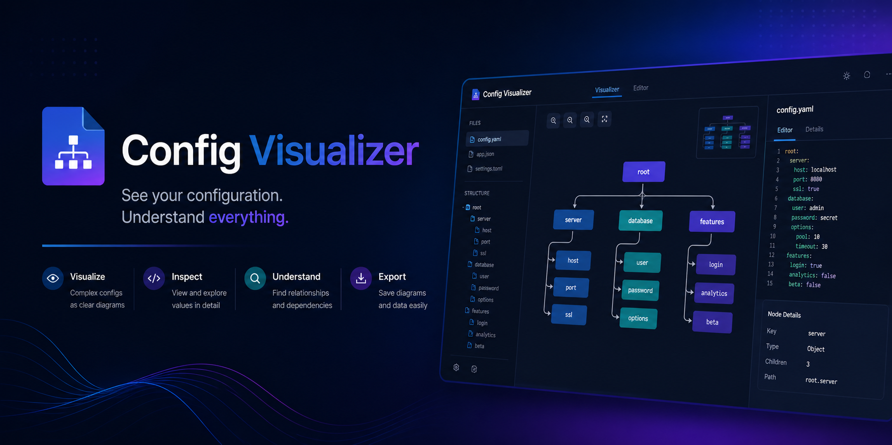

# 🚀 Universal Config Visualizer


[](https://github.com/petrsafrata/UniversalConfigVisualizer/actions/workflows/ci-release.yml)
[](https://github.com/petrsafrata/UniversalConfigVisualizer/actions/workflows/ghcr-deploy.yml)


---

## 🧾 Project Description

The Universal Config Visualizer is a web-based application designed to simplify the understanding of complex configuration files, 
such as Docker Compose. It parses configuration files and transforms them into an interactive visual graph, allowing users to clearly see 
relationships, dependencies, and structure between services.

The application consists of a backend built with Spring Boot and a frontend developed using React, with visualization powered 
by libraries like D3.js or Cytoscape.js. Its main goal is to improve readability, debugging, and analysis of 
configuration files, especially in microservice-based environments.

---

## ✨ Application Features

### ⚙ Configuration Parsing
- Automatically parses configuration files (initially Docker Compose) and extracts services, dependencies, and properties

### 📊 Graph Visualization
- Displays services and their relationships as an interactive graph, making complex configurations easy to understand
### 🧾 Service Inspection Panel
- Provides detailed information about each service, including build settings, ports, dependencies, and dependents

### ✍️ Interactive UI
- Users can explore the graph dynamically, select nodes, and inspect relationships in real time

### 🧠 Extensibility
- Designed to support additional configuration formats in the future

- Parse one docker-compose YAML input
- Extract services
- Extract `depends_on` relationships (list and map syntax)
- Build graph model (`nodes` and `edges`)
- Expose graph as JSON via REST (`POST /api/parse`)
- Provide CLI command (`configviz <docker-compose.yml>`)
- Render basic graph in frontend (React + Cytoscape.js)

---

## 🧱 Technology and Architecture

- **Backend:** Java 17, Spring Boot 4.0.3, Spring Web MVC, SnakeYAML
- **Frontend:** React 19, TypeScript, Vite, Axios, React Router, TailwindCSS
- **Containerization:** Docker, Docker compose

---

## 🐳 Docker Services

| Service | Purpose                   | Container   | Image/Build             | Ports                |
|---------|---------------------------|-------------|-------------------------|----------------------|
| `app`   | Spring Boot BA + React FA | `configviz` | build from `Dockerfile` | `8080:8080`, `80:80` |

---

## 📁 Project Structure

```text
UniversalConfigVisualizer/
├── src/main/java/cz/jpmad/UniversalConfigVisualizer
│  ├── api
│  ├── cli
│  ├── config
│  ├── model
│  └── service
├── src/main/resources
│  ├── application.yml
│  └── log4j2.xml
├── frontend/
│   ├── src/
│   │   ├── api
│   │   ├── assets
│   │   ├── components
│   │   ├── hooks
│   │   ├── pages
│   │   ├── styles
│   │   ├── types
│   │   └── utils
├── deploy/
│   ├── apache/httpd.conf
├── docker-compose.yml
├── Dockerfile
├── pom.xml
└── VERSION
```

---

## ⚙️ Prerequisites

- Docker + Docker Compose
- Java 17 (for local backend run without Docker)
- Node.js 20+ and npm (for local frontend run)
- Free ports:
  - `80` (frontend)
  - `8080` (backend)
- Enough RAM (2+ GB recommended, minimum 2 GB)
- Additional disk space for Docker images and build artifacts

---

### 🧪 Dev Mode

For local development, run backend and frontend separately:

```powershell
git clone https://github.com/petrsafrata/UniversalConfigVisualizer.git
cd UniversalConfigVisualizer
```

Run backend locally:

```powershell
.\mvnw.cmd spring-boot:run
```

> [!TIP]
> Spring Boot uses the development settings from application.yml — no configuration is required.

Then run frontend locally:

```powershell
cd frontend
npm install
npm run dev
```

Will typically run on http://localhost:5173 (or another port that Vite assigns)
> [!NOTE]
> The frontend automatically communicates with the backend (localhost:8080)

### 🚀 Prod Mode (container runtime)

For full container runtime, download the latest project release first:
- https://github.com/petrsafrata/UniversalConfigVisualizer/releases

Then run the full application using `docker-compose.yml`:

```powershell
cd UniversalConfigVisualizer
docker-compose up -d --build
```

### 🚀 Prod Mode: (from image)

You can also run application as a container image from GitHub Packages (GHCR).

In this mode:
- pull backend image from GHCR (for example: `ghcr.io/petrsafrata/configviz:<tag>`)
- create your own `docker-compose.yml`

Example image pull:

```powershell
docker pull ghcr.io/petrsafrata/configviz:v1.0.0
```

---

## 📉 Graph JSON format

```json
{
  "nodes": [
    {"id": "app", "type": "service", "metadata": {}},
    {"id": "db", "type": "service", "metadata": {}}
  ],
  "edges": [
    {"source": "app", "target": "db", "type": "depends_on"}
  ]
}
```
---

## 🌐 API usage

```powershell
$yaml = @"
services:
  app:
    depends_on:
      - db
  db:
    image: postgres
"@

Invoke-RestMethod -Method Post -Uri "http://localhost:8080/api/parse" -ContentType "application/x-yaml" -Body $yaml | ConvertTo-Json -Depth 10
```

For invalid YAML input, API returns `400 Bad Request` with JSON body:

```json
{"error":"Invalid docker-compose YAML input."}
```

---

## 🔧 CLI usage

Repository-local CLI command on Windows PowerShell:

```powershell
.\configviz.cmd docker-compose.yml
```

The wrapper script runs Spring Boot in CLI mode and prints graph JSON to stdout.

`configviz docker-compose.yml` works only if you create your own shell alias/function or install a global wrapper on `PATH`.

---

## 📚 Demo sample file

A small demo compose file is included in repository root as `sample-docker-compose.yml`.

```powershell
.\configviz.cmd .\sample-docker-compose.yml
```

---

## 🧯 Troubleshooting

### Application does not start or crashes

- Check logs
```powershell
docker compose logs app
```

---

## ⚖️ Licence

This project is open-source and released under the Apache License 2.0.
You are free to use, modify, distribute, and use it commercially under the terms of the Apache 2.0 license.
See the [LICENSE](LICENSE) file for full details.
```
Apache-2.0 – Copyright (c) 2025 Petr Šafrata
```
---


